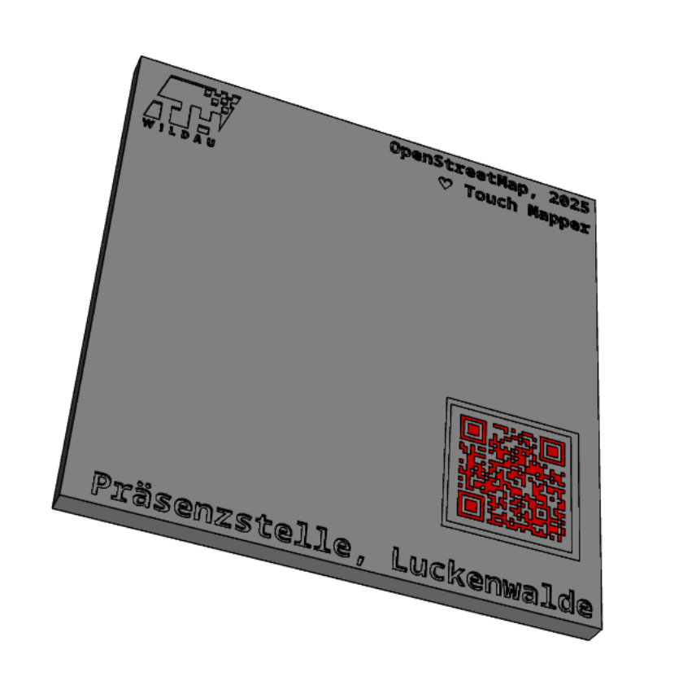
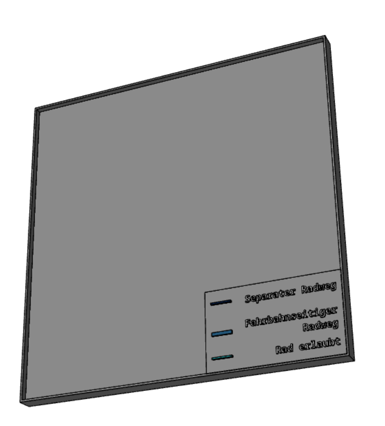
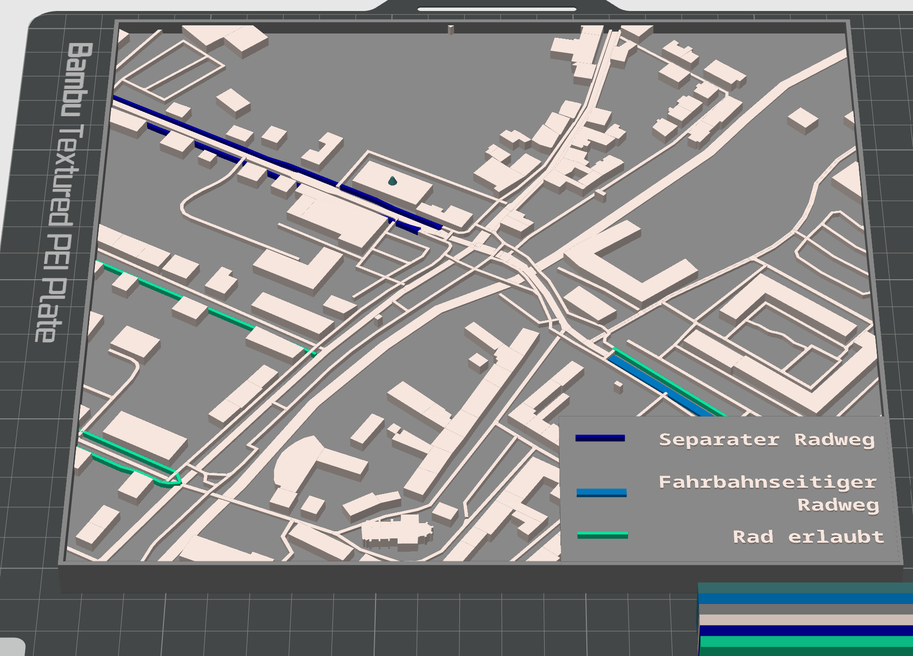
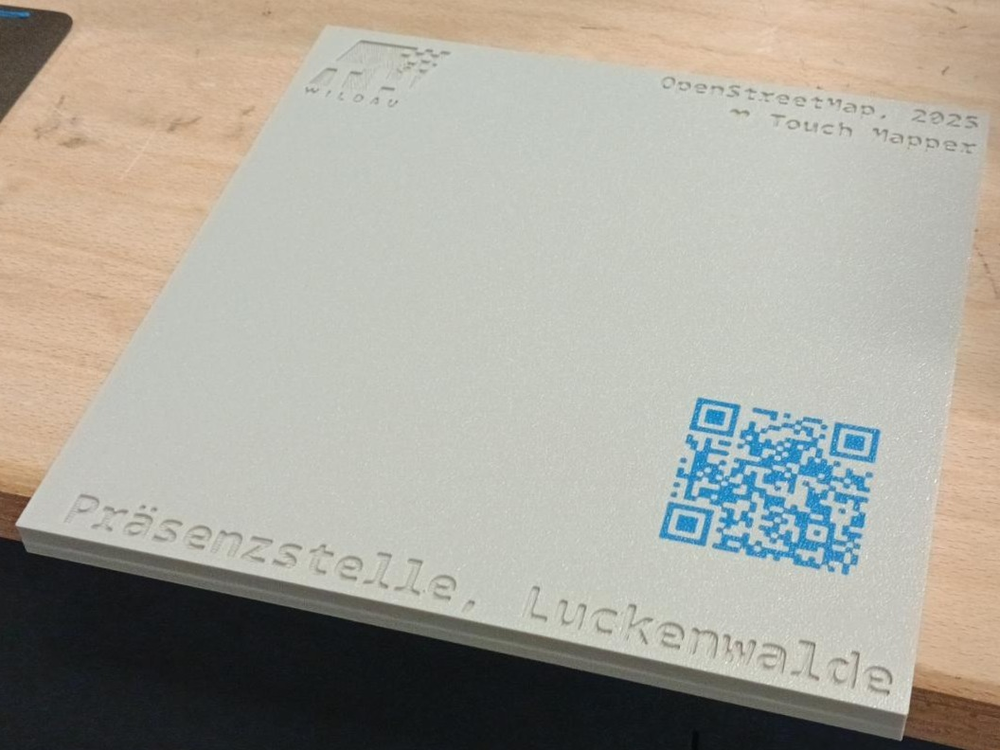
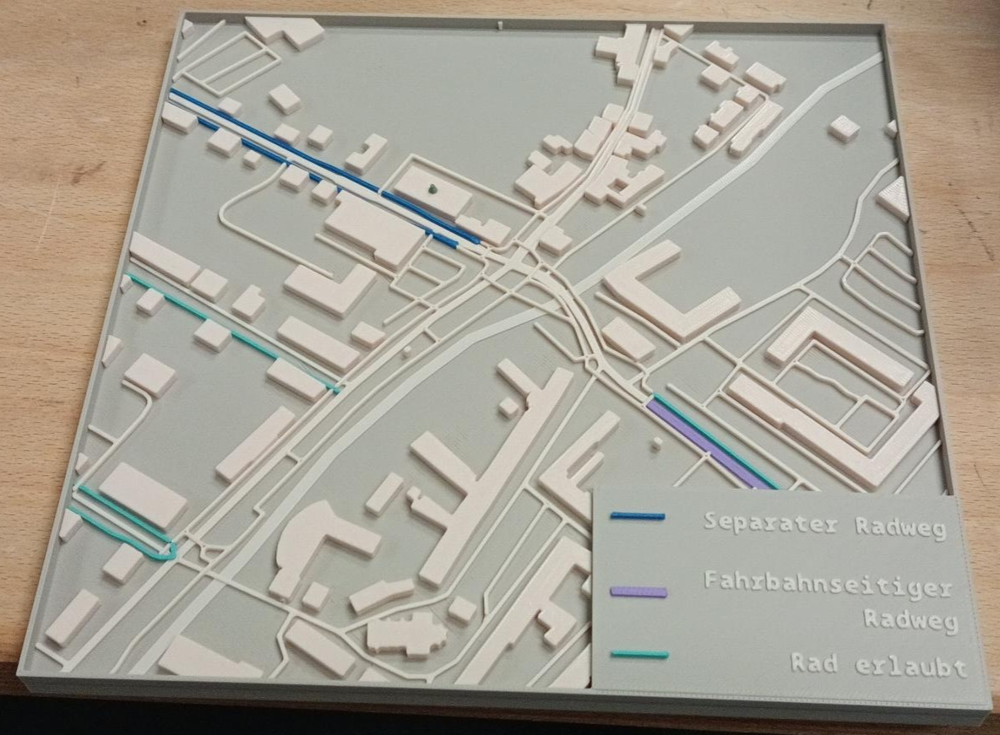

## 🚲 3D-Kartenmodelle für Radverkehrsprojekte

Dieses Projekt beschreibt die Erstellung von 3D-gedruckten Modells für Stadt- und Radverkehrsprojekte.  
Basierend auf Kartenausschnitten, die mit [Touch Mapper](https://touch-mapper.org/de/) generiert werden, werden Grundplatten mithilfe von CadQuery gestaltet. Diese werden anschließend im Slicer (z. B. Bambu Studio) zusammengeführt, weiterverarbeitet und schließlich für den 3D-Druck vorbereitet.

---

## 📁 Struktur des Repositories

- `img/`: Bilder zur Dokumentation (Screenshots, Poster)
- `.step`-Dateien: Fertige Grundplatten im CAD-Format
- `.ipynb`-Notebook: Automatisierte Generierung der Grundplatte
- `.dxf`-Datei: Logo oder grafische Elemente für die Einbettung
- `howto_bambu_assembly.txt`: Anleitung zur manuellen Assembly und Farbgestaltung in Bambustudio

---

## 🛠️ Workflow

### 1. Auswahl des Kartenausschnitts auf [Touch Mapper](https://touch-mapper.org/de/)

Ein Kartenausschnitt wird als Grundlage für das 3D-Modell gewählt.  
Hier kann das fertige STL-Modell heruntergeladen werden (empfohlen: 20x20 cm).

---

### 2. Erstellen der Grundplatte

Mit dem Jupyter Notebook wird automatisch eine Grundplatte passend zum Kartenausschnitt (inklusive Titel und QR-Code) erzeugt. Aufgrund der Mehrfarbigkeit wird eine `.step`-Datei exportiert.

    
    

---

### 3. Laden in Bambustudio

Die Assembly und das Coloring erfolgen derzeit manuell.  
Tipps und Tricks dazu stehen in der Datei `howto_bambu_assembly.txt`.

Am Ende sollte es in etwa so aussehen:  

---

### 4. 3D-Druck

Die Basisplatte wird mit einem 3D-Drucker wie dem Bambu X1 Carbon gedruckt. Dabei wird eine 0,4 mm Düse verwendet, und mithilfe des AMS-Systems können bis zu 2x4 Farben für den Druck eingesetzt werden. 

    
    

---

## 📷 Weiteres

Eine weitere Übersicht und Präsentation der Anwendung findet sich im Poster:  
➡️ [Poster ansehen (PDF)](img/20240910_Poster_Simon_TH%20Wildau_radwegedrucken.pdf)

---

## 📜 Lizenz

Dieses Projekt steht unter der [MIT-Lizenz](LICENSE).
